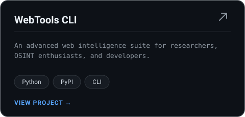
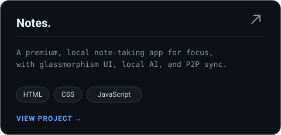
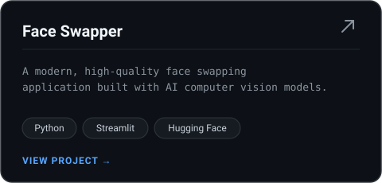
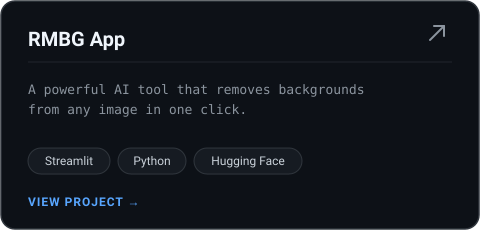
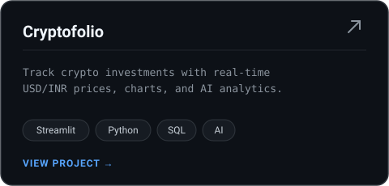
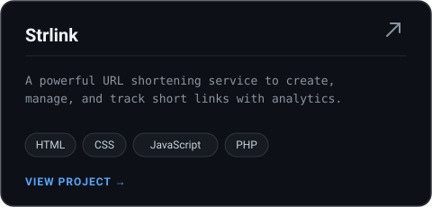

<!-- Dynamic Typewriter Banner -->
<p align="center">
  
</p>

<!-- Modern Dark Header -->
<p align="center">
  
</p>

<!-- Sleek Social Link Cards -->
<p align="center">
  <a href="https://www.linkedin.com/in/abhinavgautam08" target="_blank"></a>&nbsp;
  <a href="https://x.com/abhinavgautam08" target="_blank"></a>&nbsp;
  <a href="https://g.dev/abhinavgautam08" target="_blank"></a>
</p>

<p align="center">
  <a href="https://www.instagram.com/abhinavgautam08" target="_blank"></a>&nbsp;
  <a href="https://community.aws/@abhinavgautam08" target="_blank"></a>
</p>

<!-- Now Status Card with Profile Views -->
<p align="center">
  
</p>

<br/>

<!-- Featured Projects -->
<h3 align="center">projects</h3>

<p align="center">
  <a href="https://webtoolscli.pages.dev/" target="_blank"></a>&nbsp;
  <a href="https://notes-app.puter.site/" target="_blank"></a>
</p>

<p align="center">
  <a href="https://abhinavgautam08-faceswapper.streamlit.app/" target="_blank"></a>&nbsp;
  <a href="https://abhinavgautam08-rmbg.streamlit.app/" target="_blank"></a>
</p>

<p align="center">
  <a href="https://abhinavgautam08-cryptofolio.streamlit.app/" target="_blank"></a>&nbsp;
  <a href="https://strlink.rf.gd/" target="_blank"></a>
</p>

<br/>

<!-- Contribution Activity Graph -->
<p align="center">
  <picture>
    <source media="(prefers-color-scheme: dark)" srcset="https://raw.githubusercontent.com/abhinavgautam08/abhinavgautam08/output/pacman-contribution-graph-dark.svg" />
    <source media="(prefers-color-scheme: light)" srcset="https://raw.githubusercontent.com/abhinavgautam08/abhinavgautam08/output/pacman-contribution-graph.svg" />
    
  </picture>
</p>

<br/>

<!-- Weekly Coding Activity -->
### Weekly Coding Activity (WakaTime)

<!--START_SECTION:waka-->

```txt
From: 17 August 2026 - To: 24 August 2026

No activity tracked
```

<!--END_SECTION:waka-->

**Fun fact:** "I love exploring new tech trends!"

<br/>

<!-- Working Set -->
<h3 align="center">working set</h3>

<p align="center">
  &nbsp;&nbsp;&nbsp;
  &nbsp;&nbsp;&nbsp;
  &nbsp;&nbsp;&nbsp;
  &nbsp;&nbsp;&nbsp;
  &nbsp;&nbsp;&nbsp;
  &nbsp;&nbsp;&nbsp;
  
</p>

<br/>

<!-- Analytics & Activity Dashboard (Previous Version) -->
## Analytics & Activity Dashboard

<p align="center">
  &nbsp;
  &nbsp;
  
</p>

<br/>

<!-- LeetCode Stats -->
## LeetCode Stats

<p align="center">
  
</p>

<br/>

<!-- Achievements & Milestones -->
## Achievements & Milestones

<!-- LeetCode Badges -->
<div align="center">
  
</div>

<br/>

<!-- Holopin Badges -->
<div align="center">
  <a href="https://holopin.io/@abhinavgautam08" target="_blank">
    
  </a>
</div>

<br/>

<div align="center">
  <b>Coded with passion by <a href="https://github.com/abhinavgautam08" target="_blank" style="text-decoration: none; color: inherit;">Abhinav Adarsh</a></b><br/>
</div>
