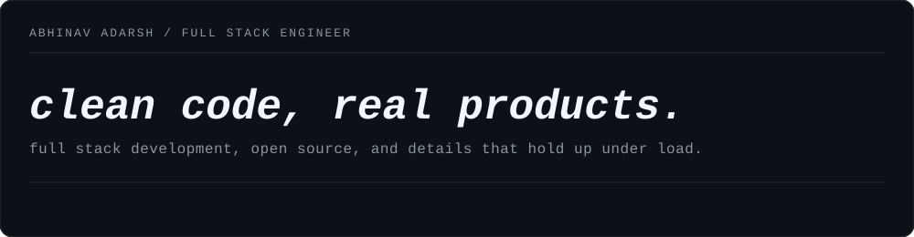
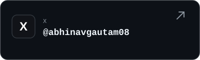
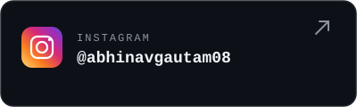
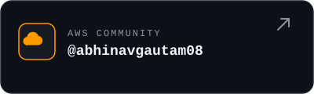
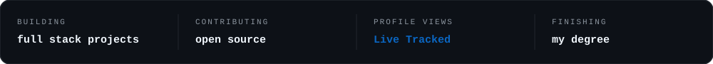

<!-- Modern Dark Header -->
<p align="center">
  
</p>

<!-- Sleek Social Link Cards -->
<p align="center">
  <a href="https://www.linkedin.com/in/abhinavgautam08" target="_blank"></a>&nbsp;
  <a href="https://x.com/abhinavgautam08" target="_blank"></a>&nbsp;
  <a href="https://g.dev/abhinavgautam08" target="_blank"></a>
</p>

<p align="center">
  <a href="https://www.instagram.com/abhinavgautam08" target="_blank"></a>&nbsp;
  <a href="https://community.aws/@abhinavgautam08" target="_blank"></a>
</p>

<!-- Profile Views Badge -->
<p align="center">
  
</p>

<br/>

<!-- Now Status Card -->
<p align="center">
  
</p>

<!-- Animated Separator -->


### Weekly Coding Activity (WakaTime)

<!--START_SECTION:waka-->

```txt
From: 21 July 2026 - To: 28 July 2026

HTML         4 hrs 50 mins         █████████░░░░░░░░░░░░░░░░   36.01 %
JavaScript   4 hrs 21 mins         ████████░░░░░░░░░░░░░░░░░   32.45 %
Markdown     3 hrs 7 mins          █████▓░░░░░░░░░░░░░░░░░░░   23.28 %
Other        32 mins               █░░░░░░░░░░░░░░░░░░░░░░░░   04.07 %
```

<!--END_SECTION:waka-->

**Fun fact:** "I love exploring new tech trends!"

<!-- Animated Separator -->


## Technology Arsenal

<h3 align="center">working set</h3>

<p align="center">
  &nbsp;&nbsp;&nbsp;
  &nbsp;&nbsp;&nbsp;
  &nbsp;&nbsp;&nbsp;
  &nbsp;&nbsp;&nbsp;
  &nbsp;&nbsp;&nbsp;
  &nbsp;&nbsp;&nbsp;
  
</p>

<br/>

<!-- Animated Separator -->


## Analytics & Activity Dashboard

<p align="center">
  
</p>

<!-- Animated Separator -->


## What I'm Currently Crafting

<div align="center">
  
</div>

🔥 **Current Adventures:**
- 🤖 Building AI-powered web applications
- 🚀 Exploring Next.js 15 and React Server Components  
- 📱 Creating responsive, user-centric interfaces
- 🔧 Automating workflows with Python scripts
- 🌐 Contributing to open-source projects

💡 **Learning Journey:**
- Advanced TypeScript patterns
- Microservices architecture
- Cloud-native development
- Performance optimization techniques

<br clear="right"/>

## My Coding Philosophy

<div align="center">
  
</div>

---

## Achievements & Milestones

<!-- LeetCode Badges -->
<div align="center">
  
</div>

<br/>

<!-- Holopin Badges -->
<div align="center">
  <a href="https://holopin.io/@abhinavgautam08" target="_blank">
    
  </a>
</div>

<!-- Animated Separator -->


## Let's Build Something Amazing Together!

<div align="center">
  
</div>

**Ready to collaborate?** Let's turn ideas into reality! 

- 💬 **Discuss:** Open to interesting conversations about tech, innovation, and the future
- 🚀 **Collaborate:** Always excited about new projects and partnerships  
- 📧 **Connect:** Drop me a message, let's create something extraordinary

---

<!-- Footer Design -->
<div align="center">
  
</div>

<p align="center">🪪 Verified Identity: 
  <strong><a href="https://www.google.com/search?q=abhinavgautam08" target="_blank" style="text-decoration: none; color: inherit;">abhinavgautam08</a>
  </strong> • Everywhere on the web 🌍</p>

<div align="center">
  <b>⚡ Coded with passion by <a href="https://github.com/abhinavgautam08" target="_blank" style="text-decoration: none; color: inherit;">Abhinav Adarsh</a>
  </b>🚀<br/>
</div>
